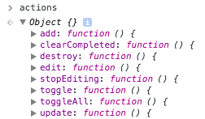
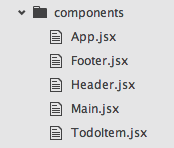

[React][react] is the latest thing to talk about in Javascript land.

And I think there might actually be a reason why people are excited!

The new programming models that emerged together with React can drastically simplify
the way we build applications.

This sounds awesome. But if you are convinced and want to get started,
you probably don't get far because you get stuck in a jungle full of different [Flux][flux] implementations.

At least that's what happened to me.
While playing around with all those different libraries and frameworks,
I picked up some core ideas I especially like:

- The whole application state in one atomic object:


- [Hot reload][hotload] application on changes:


- Clearly defined actions as single point for changing the system:




- With optional logging to see clearly what's happening:


- Actions as simple to reason about and simple to test pure functions:

```js
// actions.js
edit (render, state, todo) {
  render(
    state.set('editing', todo.get('id'))
  )
}

// actions.test.js
t.test('edit', t => {
  t.plan(1)

  var todo = todos.first()

  actions.edit(s => {
    t.equal(s.get('editing'), todo.get('id'), 'edits the right todo')
  }, state, todo)
})
```


- Interactively trigger actions and modify the state:


- One render function to render the whole application as a tree composed of many simple components:




- Pure components together with the [PureRenderMixin][pure] and [immutable][immutable] data structures


- [ES6 syntax][es6] for improved readability:

```js
  clearCompleted (render, state) {
    render(
      state.update('todos', todos => todos.filter(
        todo => !todo.get('completed')
      ))
    )
  }
```

If you think this sounds interesting and you just want to see a simple application
as an example how this could work, I might have something for you!

It turns out, you don't need any framework or library to get all this.
I created __[Miniflux-TodoMVC][miniflux]__ as a starting point for everyone curious.


[react]: http://facebook.github.io/react/
[flux]: https://facebook.github.io/flux/
[es6]: https://babeljs.io/
[pure]: http://facebook.github.io/react/docs/pure-render-mixin.html
[hotload]: https://github.com/gaearon/react-hot-loader
[immutable]: http://facebook.github.io/immutable-js/
[miniflux]: https://github.com/jorin-vogel/miniflux-todomvc
